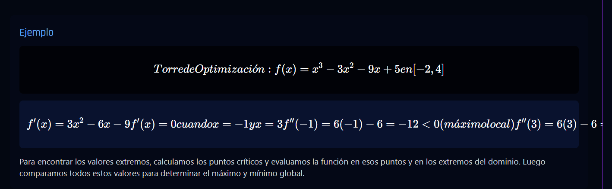

# CyberCalc - Aplicación Educativa de Cálculo

Un plataforma educativa interactiva para aprender derivadas de cálculo a través de una interfaz inmersiva inspirada en la estética cyberpunk. La aplicación aprovecha tecnologías web de vanguardia para transformar el aprendizaje matemático en una experiencia visualmente dinámica y atractiva.



## Tecnologías Principales

- **Frontend**: React con TypeScript
- **Renderizado de Fórmulas**: LaTeX (KaTeX)
- **Estilos**: Tailwind CSS con temas cyberpunk personalizados
- **Efectos Visuales**: Framer Motion para animaciones
- **Backend**: Express.js
- **Almacenamiento**: Persistencia de datos basada en archivos
- **Autenticación**: Passport.js con sesiones locales

## Características

- **Teoría Interactiva**: Explicaciones paso a paso de las reglas de derivación con fórmulas LaTeX
- **Sistema de Quiz**: Desafíos en tres niveles de dificultad (fácil, medio, difícil)
- **Retos Aleatorios**: Ejercicios de derivación con sistema de puntos y vidas
- **Modo Historia**: Escenarios narrativos con problemas matemáticos integrados
- **Tabla de Clasificación**: Ranking de usuarios basado en puntos
- **Interfaz Cyberpunk**: Diseño futurista con efectos visuales y animaciones
- **Diseño Responsive**: Adaptado para dispositivos móviles, tablets y escritorio

## Instalación

1. Clona el repositorio:
   ```bash
   git clone https://github.com/[TU-USUARIO-GITHUB]/cybercalc.git
   cd cybercalc
   ```

2. Instala las dependencias:
   ```bash
   npm install
   ```

3. Inicia el servidor de desarrollo:
   ```bash
   npm run dev
   ```

4. Abre tu navegador en `http://localhost:5000` para ver la aplicación

## Estructura del Proyecto

- `/client`: Código del frontend
  - `/src/components`: Componentes de React
  - `/src/pages`: Páginas principales de la aplicación
  - `/src/hooks`: Custom hooks de React
  - `/src/lib`: Utilidades y funciones auxiliares
- `/server`: Código del backend
  - `/routes.ts`: Definición de rutas API
  - `/storage.ts`: Capa de persistencia de datos
  - `/auth.ts`: Configuración de autenticación
- `/shared`: Código compartido entre frontend y backend
  - `/schema.ts`: Esquemas de datos y tipos

## Despliegue

Para construir la aplicación para producción:

```bash
npm run build
```

Para iniciar la aplicación en modo producción:

```bash
npm start
```

## Licencia

MIT